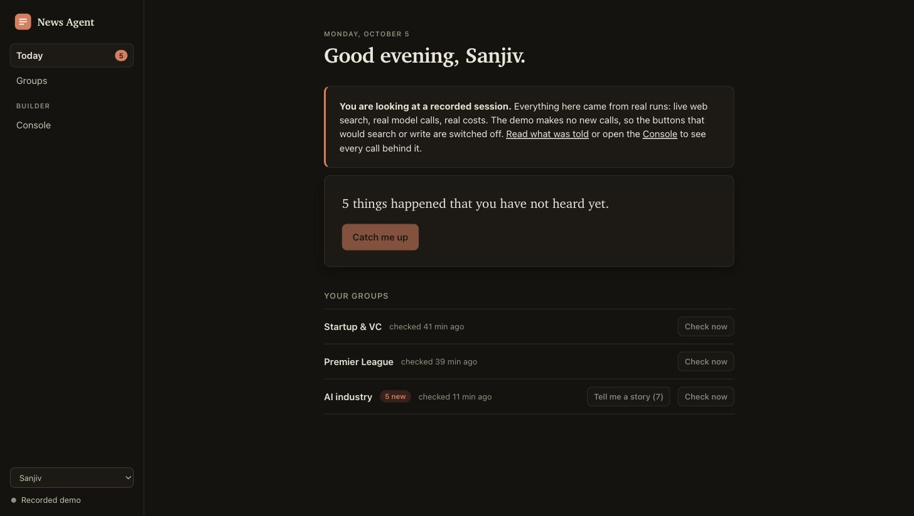
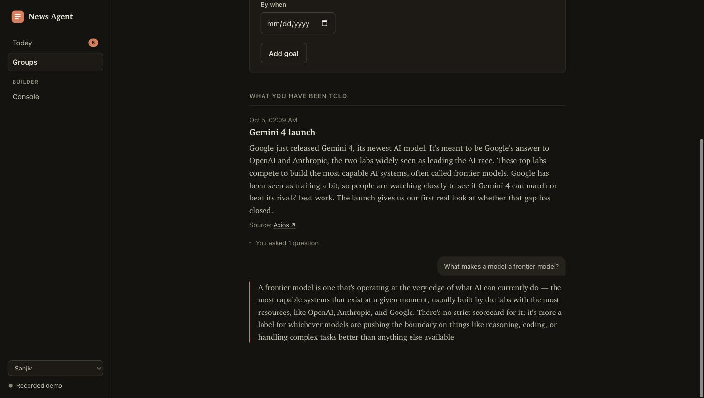
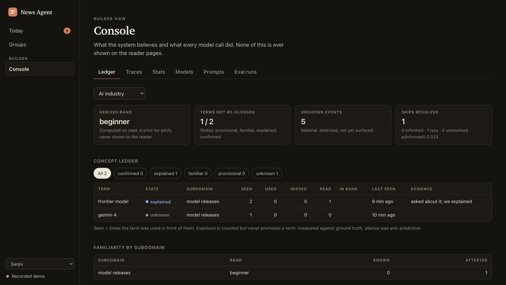
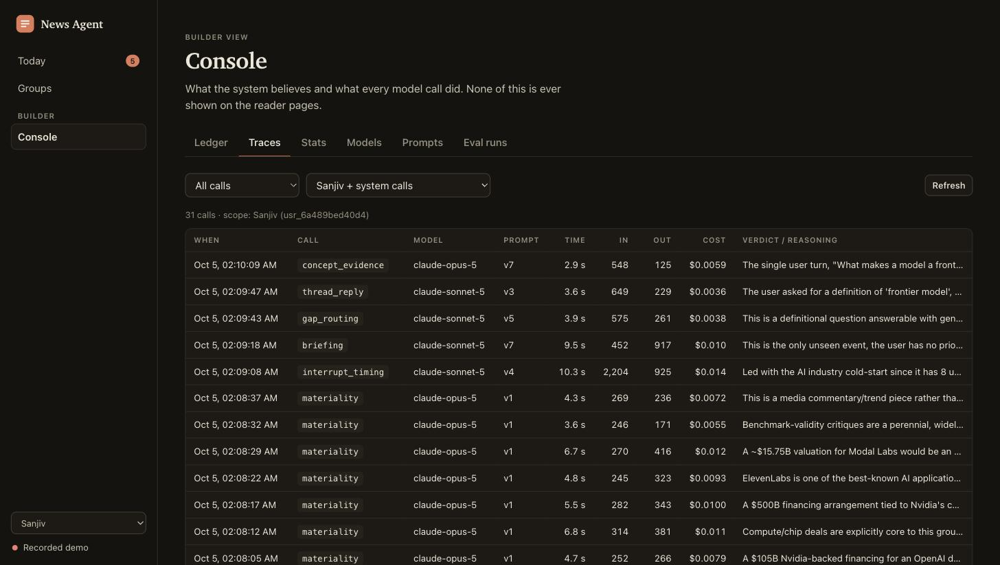
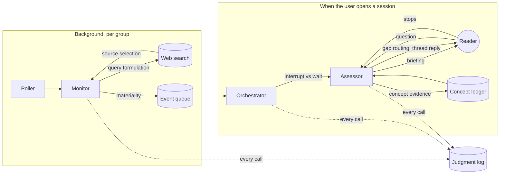
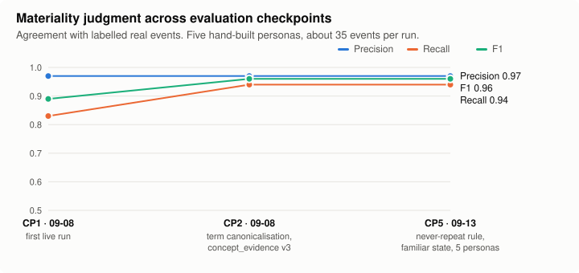
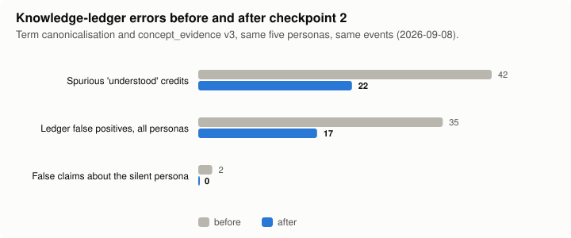
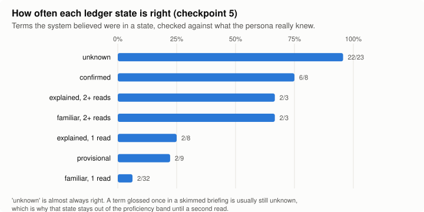
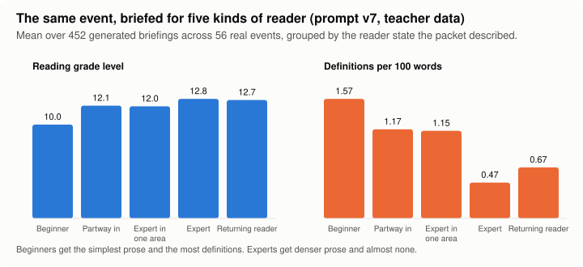

# Adaptive News Briefing Agent

**An AI agent that keeps you conversant with the groups you care about.**

You name the circles whose conversations you want to follow: Premier League
fans, startup founders, wine people, the AI industry. The agent watches the news
for each one, decides what someone in that circle would be expected to know,
tells you plainly what happened, and answers whatever you ask about it. It
never quizzes you. What you ask, and how you ask it, is how it learns what you
already know, so the next briefing explains less of what you have and more of
what you lack.

| Today | A briefing and a follow-up |
|---|---|
|  |  |
| **Concept ledger (builder console)** | **Every model call, traced** |
|  |  |

Screenshots are from the bundled demo, which replays a real recorded session.

## Try the demo

There is no hosted instance, because a live one would spend API credit for
anyone who found it. Instead the repository ships a **recorded real session**
that runs locally in one command, with no API key and no dependencies beyond
Python 3.11:

```bash
git clone https://github.com/sanjivp2703/adaptive-news-briefing-agent.git && cd adaptive-news-briefing-agent
PYTHONPATH=src python3 -m conversational_agent.web --demo --open
```

It opens http://127.0.0.1:8787 on a store captured from live runs on
2026-10-05: three groups, 15 events found by live web search, two briefings
with their follow-up threads, and all 31 model calls with their inputs,
verdicts, reasoning, latency and cost. The demo reads; it does not fake. The
buttons that would search or write are switched off and say why.

To run it live, see [Running it](#running-it).

## Contents

- [Who it is for](#who-it-is-for)
- [What it does](#what-it-does)
- [How it works](#how-it-works)
- [The knowledge model](#the-knowledge-model)
- [Evaluation](#evaluation)
- [Model training track](#model-training-track)
- [Status: where this stands and what is left](#status-where-this-stands-and-what-is-left)
- [Running it](#running-it)
- [Repository layout](#repository-layout)
- [Further reading](#further-reading)

## Who it is for

Someone who wants to hold their own in a conversation they are currently
outside of. A new hire whose team talks football. A founder about to have
dinner with investors. A person dating into a family of wine people.

The first design assumed a user who already knew the domain and had gaps. The
first real user could not answer a single one of its opening questions; they
were a beginner in every group. So the product is built for the cold start:
it assumes nothing, explains terms as it goes, and stops explaining a term
only when there is evidence you have it.

## What it does

**For the reader**

- **Follow any group.** A group is a name and an optional description. There
  is no fixed list of domains and no per-domain source list; search queries
  and source trust are decided per group at run time, which is what lets it
  handle a group nobody anticipated.
- **Continuous monitoring.** Each group is polled on its own interval by a
  background process, whether or not you are using the app. Findings queue
  up; nothing is pushed at you.
- **Sessions on your terms.** When you open a session, the agent decides what
  is worth your time now and what can wait. Held-back items stay queued.
- **Plain briefings.** One story at a time, stated plainly, with unfamiliar
  terms defined inline once. Depth is pitched per topic: you can be an expert
  on transfers and a beginner on officiating rules in the same group.
- **Follow-up threads.** Ask anything. Answers come from the source material
  first, from a fresh web search when the answer is not held, and say so
  plainly when neither has it. It does not invent figures.
- **Never told twice.** A story is briefed once. If there is nothing new, it
  says nothing.
- **Goals.** "Dinner with the investors on Thursday" raises a group's
  priority until the date passes. Closing a goal never resets what you know.
- **Multi-user from the first line.** Every read and write goes through a
  user-scoped handle that has no API accepting another user's id.

**For the builder**

- **Full tracing.** Every model call writes one row: exact input, structured
  verdict, the model's stated reasoning, model, prompt version, tokens,
  latency, cost.
- **A console** over those rows, in the browser and the CLI: the concept
  ledger with the evidence behind each term, traces, cost and latency stats,
  model routing, prompt versions, evaluation runs.
- **Per-call model routing**, overridable by environment variable, including
  a seat for a local open-weight model.
- **An evaluation harness** with simulated users, a regression gate, and a
  tool that turns gate failures into proposed prompt diffs.

## How it works

Three components, one store, and a small number of places where a model is
asked to make a judgment. Everything else (polling on a timer, queueing,
counting, deadlines, the ledger's state machine) is deterministic code,
deliberately kept out of the model's hands.



- **Monitor** runs per (user, group). It formulates search queries, runs
  server-side web search, decides which results to trust, and judges whether
  each event is *material*: would someone conversant in this group be
  expected to know it? Materiality is a property of the group, not of the
  reader.
- **Orchestrator** is the only component that decides what reaches the user.
  "Worth recording" and "worth interrupting with" are different bars.
- **Assessor** owns what the user knows. It writes the briefing, answers
  questions in the thread, and, once the user stops, reads the whole thread
  for evidence about specific terms.
- **Store** is a single SQLite file. Not an agent.

### The model calls

Each is a direct Messages API call with a versioned prompt and a JSON schema
for the verdict. There is no agent framework; the control flow is ordinary
Python.

| Call | Owner | The question it answers | Default model |
|---|---|---|---|
| `query_formulation` | Monitor | What should we search for, for this group? | Opus |
| `source_selection` | Monitor | Which results are real, recent and trustworthy? | Opus |
| `materiality` | Monitor | Would a conversant person be expected to know this? | Opus |
| `interrupt_timing` | Orchestrator | What reaches the user this session, and what waits? | Sonnet |
| `gap_routing` | Assessor | Can this question be answered from what we hold, or must we look? | Sonnet |
| `concept_evidence` | Assessor | What did this thread reveal about which terms the user has? | Opus |
| `briefing` (generative) | Assessor | State this event plainly for this reader. | Sonnet |
| `thread_reply` (generative) | Assessor | Answer the question that was asked. | Sonnet |

The first six are scored judgment points; the last two are generative and are
measured through the harness rather than against labels. Opus takes the calls
whose errors propagate (a wrong materiality verdict is the embarrassment the
product exists to prevent; a wrong evidence verdict corrupts the ledger).

## The knowledge model

There is no score. Knowledge is a **concept ledger**: one row per term per
group, in one of five states, each backed by an observed event.

| State | Meaning | How a term gets there |
|---|---|---|
| `unknown` | No evidence, or a revealed misunderstanding | Default; any state reverts here on a miss |
| `provisional` | Used correctly once | One correct use in the user's own words |
| `familiar` | We defined it and they read that | Glossed in a briefing whose reading signal says it was looked at |
| `explained` | They asked, we explained | A question about the term, answered in the thread |
| `confirmed` | They have it | Two independent correct uses |

Rules that follow from evidence rather than taste:

- **Silence is not evidence.** An earlier version inferred understanding from
  terms the user saw and did not question. Measured against simulated users
  with known ground truth, that inference was anti-predictive at every
  threshold tried, and it was deleted.
- **Reading is attention, not comprehension.** The browser measures how long
  a briefing was visible and how far it was scrolled. That signal can close
  an item out of the "new" count and credit one read explanation. Nothing
  else about it reaches the ledger.
- **Proficiency is derived, coarse and private.** A band per group and per
  subdomain is computed on read from the ledger, used only to pitch the next
  briefing, and never shown to the user.
- **No decay.** Falling behind is counted (events not yet shown), not
  modelled.
- **A skip means nothing on its own.** A skipped briefing is labelled
  informed or lazy only by later evidence about the terms it defined.

The reasoning and the measurements behind each rule are in
[docs/architecture.md](docs/architecture.md) and
[docs/checkpoints.md](docs/checkpoints.md).

## Evaluation

The hard part of this product is that its central claim, "the system knows
what you know", cannot be checked against a real user without quizzing them.
So the evaluation harness (`harness/`) builds users whose knowledge *is*
known:

- **Personas** built from real, verified events: five hand-written and
  sixteen generated across four groups and four archetypes. Each has a
  concept set, a reply style drawn from a study of real human-to-assistant
  messages, and reading behaviour.
- **A learning model.** Each persona's memory for each term follows a
  spaced-repetition (FSRS-style) curve, so what they know changes as they
  are briefed, and ground truth is dynamic.
- **A hidden probe.** After a session, outside the system's view, the persona
  is asked about each term and graded 0 to 3. The ledger is scored against
  that.
- **A regression gate** (`harness/gate.py`) in three tiers, including hard
  checks that no story is repeated and no figure appears that is not in the
  source.
- **A proposer** (`harness/propose.py`) that turns gate failures plus
  verbatim evidence into at most three prompt diffs, constrained by every
  recorded human decision. It writes nothing unless told to apply.

The offline mode stubs the model and the event feed and is byte-reproducible.
It checks structure, not judgment: a stub has none.

### The evaluation sets

Everything below is checked in under `harness/personas/`, except the
calibration corpora, which are third-party and fetched by script.

| Set | What it is | Size | Used for |
|---|---|---|---|
| Hand-built personas | Five simulated readers over three groups: a startup operator and a newcomer to startup funding, a wine-trade professional and a barely-following wine reader, and a Premier League follower. Each has a concept set with ground truth, a reply style, and a reading profile. | 5 personas, 8 real events each | Every live run; all headline numbers |
| Generated personas | Four archetypes per group (beginner, partial, expert, expert in one subdomain) over Premier League, NFL, crypto and AI trends, drafted by a model and validated by code. | 16 personas, 29 events | Offline runs; no scored live run yet |
| Real events | News from August to September 2026, each verified against its source page and labelled major, borderline or minor. | 40 hand-built, 29 generated | Materiality ground truth; briefing subjects |
| Materiality labels | The author's material / not-material label on each event a run judged. | about 40 per five-persona run | Precision, recall, F1 |
| Hidden probe | After a session, each persona is asked about every term outside the system's view and graded 0 to 3. | one probe per term per session | Ledger precision and recall |
| WildChat-1M | Real human-to-assistant conversations, filtered to turns that follow an informational reply; 80 hand-classified. | 8,000 conversations, 507 turns | Persona register: how often they ask, extend, check a belief or stay silent |
| Hacker News | Comment threads on the same topics. | 1,286 comments | Reply-length distribution only |
| Distillation set | Briefings written by Claude for synthetic reader states over the real events. | 500 generated, 452 pass checks | Training the local model (held out: 45) |

### Measured progress

The model has not been fine-tuned yet, so there is no training curve. What
there is: five live evaluation checkpoints in which the prompts and the
knowledge model were revised against the same personas and events, with the
numbers recorded before and after each change. All four charts are drawn from
[docs/charts/data.json](docs/charts/data.json), which cites its sources, by
[docs/charts/make_charts.py](docs/charts/make_charts.py).



Precision held at 0.97 throughout. Recall rose from 0.83 to 0.94 at
checkpoint 2, when term canonicalisation and a revised evidence prompt stopped
the ledger from fragmenting, and held there at checkpoint 5.



The same checkpoint halved spurious "understood" credits and ledger false
positives, and removed every false claim about the persona who never speaks.
That persona exists to catch exactly this: any term it is credited with is
wrong by construction.



Checkpoint 5 was the first complete five-persona run on the corrected
system: 34 briefings, 34 distinct events, zero repeats, where the run before
had told one persona the same story five times. The chart shows what the
ledger gets right by state. The weakest row is reported on purpose: a term
glossed once in a skimmed briefing is usually still unknown, which is why
that state is excluded from the proficiency band until a second read.



The last chart is about the training data rather than a checkpoint. It shows
that the briefing prompt, given the same events, writes measurably simpler
prose with more definitions for a beginner and denser prose with almost none
for an expert. That adaptation is what the local model is being trained to
reproduce.

**Caveats.** The samples are small, the materiality labels are the author's
own, and no live run has yet passed the harness's ledger gate (precision 0.75
and recall 0.70 against each persona's real knowledge). These are evidence the
pieces work and that each revision helped, not a benchmark.

## Model training track

A second goal of the project is hands-on experience moving one component from
a frontier API model to a small local one. The component is the briefing
writer; the yardstick is the same harness.

| Stage | Method | State |
|---|---|---|
| Data | Distillation set: Claude writes briefings for synthetic reader states over 56 real events | **Done.** 500 generated, 452 pass automated faithfulness checks, split 415 / 45 |
| 1 | Supervised fine-tuning of Qwen2.5-3B-Instruct with a LoRA adapter | Notebook written (`training/notebooks/01_sft_colab.ipynb`); **not yet run** |
| Serving | Local model in the briefing seat via an OpenAI-compatible endpoint | **Done** and tested (`LOCAL_MODEL_*` variables) |
| 2 | DPO on preference pairs ranked by the gate's rules, then a Claude judge | Planned; no code yet |
| 3 | RLAIF: a reward model trained on Claude's preferences, optimised with GRPO, the gate as guardrail | Planned; no code yet |

See [training/README.md](training/README.md).

## Status: where this stands and what is left

**Working today**

- The full product loop, live: monitoring, sessions, briefings, threads,
  the ledger, goals, multiple users.
- Two interfaces over the same code: a web app and a CLI.
- Tracing and the console.
- The evaluation harness, the gate, the proposer, 21 personas.
- The distillation data pipeline and local-model routing.
- An offline test suite (see [Running it](#running-it)) and CI.

**Known weaknesses**

- **Concept labels fragment.** The evidence extractor can name one idea
  several ways (`run-rate`, `annualized revenue`), so evidence spreads across
  rows and few terms reach `confirmed`. Merge-on-write canonicalisation
  catches some of this, not all.
- **Questions presuppose terms.** A question both asks about some terms and
  correctly uses others. The extractor sometimes credits or debits the wrong
  ones. It is measured (`presupposition_confusion`), not yet fixed.
- **No live run has passed the ledger gate yet.** The harness asks for ledger
  precision of 0.75 and recall of 0.70 against each persona's real knowledge.
  Materiality and never-repeat hold; the ledger does not reach that bar,
  mostly for the two reasons above.
- **Thresholds are not agreed.** The harness reports materiality and
  evidence accuracy; it gates only on structural checks and regressions.
- **Small samples.** The headline numbers come from five personas. The
  sixteen generated personas have not had a full scored live run, and the
  current briefing prompt (v7) postdates the last scored run.
- **The specification predates the web app** and still lists a web UI as out
  of scope.

**Not done**

1. Run the Stage 1 fine-tune and score the student against Claude on the
   harness.
2. Stages 2 and 3 of the training track.
3. A scored live run over all 21 personas on the current prompts, to
   establish a baseline for the gate.
4. Authentication and hosting. The web app is single-machine, binds to
   loopback, and has no login.
5. Push delivery. Delivery is pull-only by design in this version.

Slice-by-slice build state is in [pipeline-status.md](pipeline-status.md).

## Running it

Requires Python 3.11 or newer. The only runtime dependency is the Anthropic
SDK; the web server, the CLI and the store are standard library.

```bash
python3 -m venv .venv
.venv/bin/pip install -e ".[dev]"
cp .env.example .env        # add ANTHROPIC_API_KEY for live use
```

**Web app**

```bash
set -a; source .env; set +a
.venv/bin/news-agent-web --open          # live, http://127.0.0.1:8787
.venv/bin/news-agent-web --demo --open   # recorded session, no key
```

Flags: `--port`, `--db PATH`, `--poll` (start with background checking on),
`--tick SECONDS`. Background checking is off until switched on, because it
makes billed calls. The server answers only on localhost and refuses requests
another website could forge; it has no login and is not meant to be hosted
as is.

**CLI**

```bash
.venv/bin/news-agent init --name "Your Name"
.venv/bin/news-agent group add "Premier League" --description "results, transfers, managers"
.venv/bin/news-agent poll            # look for news now (live)
.venv/bin/news-agent session         # be briefed and ask questions (live)
.venv/bin/news-agent ledger "Premier League"
.venv/bin/news-agent traces          # every model call
.venv/bin/news-agent stats           # cost and latency per call type
```

Only `poll` and `session` need a key.

**Tests and lint**

```bash
.venv/bin/pytest -q      # fully offline, a few seconds
.venv/bin/ruff check .
```

**Evaluation harness**

```bash
PYTHONPATH=src:. .venv/bin/python -m harness.verify_offline   # structural checks, no network; must pass
PYTHONPATH=src:. .venv/bin/python -m harness.run              # full persona run, offline by default
PYTHONPATH=src:. .venv/bin/python -m harness.run --live --parallel 5   # live; costs a few dollars
```

The offline run drives the whole system with a scripted stub in place of the
model. It exists to exercise plumbing and reproducibility, and it reports
`RESULT: FAIL` for two personas whose ledgers a stub cannot fill: a stub has
no judgment, so the judgment-quality gates are not expected to pass offline.
`verify_offline` is the check that must be green without a network.

See [harness/README.md](harness/README.md).

## Repository layout

```
src/conversational_agent/
  monitor.py  orchestrator.py  assessor.py   the three components
  judgments.py  judgment.py                  the model calls; the traced, schema-checked call wrapper
  prompts/                                   one versioned prompt per call
  store.py  db.py  models.py                 SQLite store, user-scoped access, the ledger state machine
  search.py  scheduler.py                    web search plumbing; the background poller
  config.py  local_client.py                 model routing; the local-model seat
  cli.py                                     command-line interface and console
  web/                                       HTTP server, reader and console APIs, browser app, demo store
harness/                                     persona evaluation, regression gate, prompt proposer
training/                                    distillation data pipeline and the fine-tuning notebook
tests/                                       offline test suite
docs/                                        architecture, specification, decision log, prompt changelog
```

## Further reading

- [docs/architecture.md](docs/architecture.md): the technical description.
  Data flow, the store, the call wrapper, the ledger's rules, the web
  surface, and the reasoning behind each.
- [docs/checkpoints.md](docs/checkpoints.md): the decision log. Each live
  evaluation, what it showed, and what the human decided.
- [docs/prompt-changelog.md](docs/prompt-changelog.md): every prompt version,
  the failure that prompted it, and what was measured after.
- [docs/spec.md](docs/spec.md): the product specification.
- [harness/README.md](harness/README.md),
  [harness/LEARNING.md](harness/LEARNING.md): the evaluation harness and the
  persona learning model.
- [training/README.md](training/README.md): the training track, written for
  someone new to fine-tuning.

## How it was built

Specification first, then independent feature slices, then repeated cycles of
live evaluation and human decision, recorded in the checkpoint log. Much of
the code was written with an AI coding agent (Claude Code) working under that
process: the human set direction, made every product decision, and audited
the evaluation results; the decisions and their evidence are in the documents
above.
